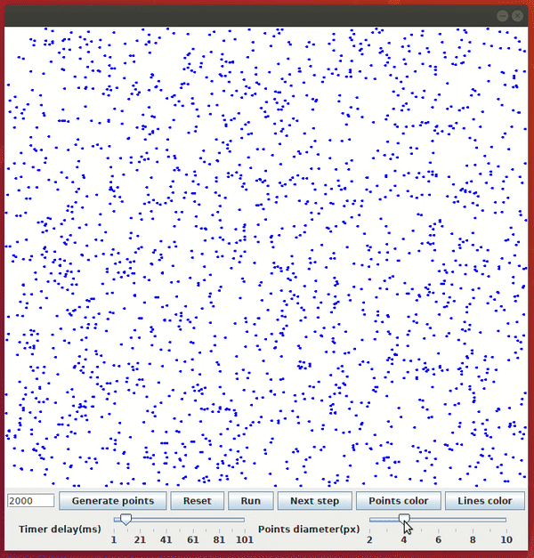

# Convex Hull

In mathematics, the convex hull or convex envelope or convex closure of a set X of points in the Euclidean plane or in a Euclidean space (or, more generally, in an affine space over the reals) is the smallest convex set that contains X. For instance, when X is a bounded subset of the plane, the convex hull may be visualized as the shape enclosed by a rubber band stretched around X.  
This Java program is the implementation of the Quick Hull algorithm to calculate the convex hull of some points generated randomly.

## Program features

* The user is able to specify the desired amount of points that will be generated randomly using a text field and a button.

* The simulation can be executed step by step or with a timer.

* There are buttons to change the lines and points colors.

* There are sliders to specify the radius of the points and the delay of the timer which will control the simulation.


Points generation          |  Simulation
:-------------------------:|:-------------------------:
  |  


Colors                     |  Sliders
:-------------------------:|:-------------------------:
  |  

## Execution

For execution, try the command below:
```bash
  java -jar ConvexHull.jar numberOfPoints timerDelay(ms)
```

<p align="center"></p>

## Author

Daute Rodríguez Rodríguez
